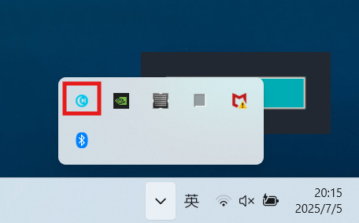

<p align="right">
  <a href="../README.md">中文</a>
</p>

[](../LICENSE)

# Tiny Pomodoro

Tiny Pomodoro is a lightweight Pomodoro work/rest management tool based on the system tray, featuring a dark theme design, real-time statistics, and notifications, focusing on a minimalist experience.

Currently Windows only.

## Download

[⬇️ Tiny Pomodoro](../tiny_pomodoro.exe) (double-click to run, no installation required)

## Usage

After launching the program click the "Start Work" button to begin timing!

### Tray menu

Right-click the tray icon to open the menu.  


The menu shows your current status and statistics, and also lets you open the settings window to change language, work duration and break duration.

### Auto start on login

Create a shortcut to the executable and copy it to `C:\ProgramData\Microsoft\Windows\Start Menu\Programs\Startup`.

## Build from source

1. Clone the repository

```bash
git clone https://github.com/xcczach/tiny-pomodoro.git
cd tiny-pomodoro
```

2. Package an executable (Windows). Python must be installed.

- Git Bash: `bash build.sh`
- PowerShell: `powershell -ExecutionPolicy Bypass -File .\\build.ps1`
- CMD: `build.cmd`

## License

This project is licensed under the MIT License. See [LICENSE](../LICENSE) for details. 